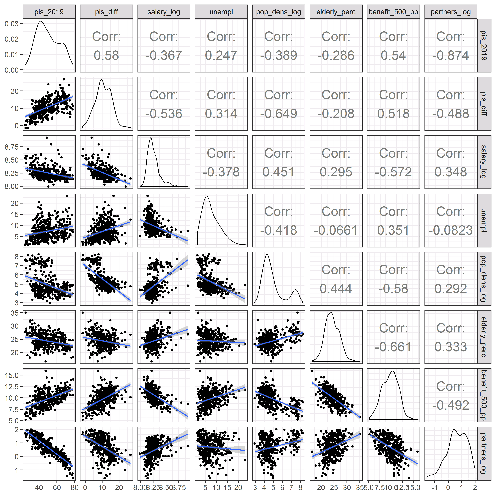

```{r setup, include=FALSE}
knitr::opts_chunk$set(
	echo = FALSE,
	message = FALSE,
	warning = FALSE,
	cashe = TRUE,
	dev="png", dev.args=list(type="cairo"), dpi = 300
)
```

```{r echo = FALSE}
library(dplyr)
library(tidyr)
library(foreign)
library(openxlsx)
library(ggplot2)

library(rgdal)
library(sp) # do tworzenia centroidow
library(maptools)
library(rgeos)
library(RColorBrewer)
library(ggmap)

library(geospacom)
library(spdep)

library(grid)

library(leaflet)
library(widgetframe)

# ###################################################################
# Setting working directory and loading data
# ###################################################################
if(Sys.info()["sysname"] == "Windows"){
    main_dir <- "D:/Osobiste/GitHub"
} else {
    main_dir <- "/home/rstudio/"
}
setwd(main_dir)

source("EP2019/scripts/functions.R", encoding = "UTF-8")

load("EP2019/data/dataset.RData")

# mapa <- readOGR(dsn = "Maps/Powiaty/powiaty.shp")
# mapa <- spTransform(mapa, "+proj=longlat")
load("EP2019/data/map_simplified.RData")
mapa <- merge(y = dataset, x = mapa, by.x = "jpt_kod_je", by.y = "TERYT")

```

Na poniższych mapa można zobaczyć wyniki wyborów do Parlamentu Europejskiego w 2019 r. zmianę poparcia głównych partii w stosunku do ich wyników z 2015 r. oraz główne zmienne społeczno-demograficzne oraz gospodarcze. 

**Uwaga ze względu na ograniczoną funkcjonalność pakietu *Leaflet* przed zmianą mapy należy najpierw odznaczyć obecną mapę, a dopiero póżniej wskazać kolejną.**

<br>

# Poparcie w wyborach do PE 2019

```{r echo = FALSE, fig.width=7, fig.height=8, fig.align = 'center', results='asis', cache=FALSE}
num_var <- 7
plot_leaflet_map_groups(mapa, variables_to_plot = c("votes_pis_perc", "votes_ke_perc", "votes_wiosna_perc", "votes_konfederacja_perc", "votes_kukiz_perc", "votes_razem_perc", "frekwencja"),
                        groups_names = c("PiS", "KE", "Wiosna", "Konfederacja", "Kukiz", "Razem", "Frekwencja"), 
                        name_of_region = "nazwa",
                        popup_texts = c(rep("Poparcie: ", 6), "Frekwencja: "),  end_texts = rep("%", num_var), 
                        legend_digits = c(rep(0, 2), rep(1, 5)), popup_round = 2, frame_height = 500)
```

<br><br>

# Zmiana poparcia 

Zmiana poparcia przedstawia różnicę między wynikiem danego komitetu w wyborach do PE, a poparciem w wyborach do sejmu z 2015 r.

Na potrzeby obliczenia zmiany poparcia poszczególnych komitetów wyborczych, przyjęto że Koalicja Europejska w 2015 składałaby się z PO, Nowoczesnej, SLD oraz PSL - ich też poparcie 2015 zsumowano. W przypadku Konfederacji natomiast dodano wynik partii Korwin oraz komitetu Szczęść Boże Grzegorza Brauna. Niestety, nie można w prosty sposób wyznaczyć ile w wyborach parlamentarnych z 2015 poparcia zdobyłby Ruch Narodowy, który startował z listy Kukiz'15. Z tego powodu, poparcie dla formacji Kukiz'15 porównano bezpośrednio z jej wynikiem z poprzednich wyborów.

Dodatkowo, w celach porównawczych na mapie zmiany poparcia umieszczono kartogram przedstawiający poparcie jakie uzyskał PSL w 2015 r.

<br>


```{r echo = FALSE, fig.width=7, fig.height=8, fig.align = 'center', results='asis', cache=FALSE}
num_var <- 7
plot_leaflet_map_groups(mapa, variables_to_plot = c("votes_pis_perc_diff", "votes_ke_perc_diff", "votes_konfederacja_perc_diff", "votes_kukiz_perc_diff", "votes_razem_perc_diff", "frekwencja_diff", "votes_2015_psl_perc"),
                        groups_names = c("PiS", "KE", "Konfederacja", "Kukiz", "Razem", "Frekwencja", "PSL 2015"), 
                        name_of_region = "nazwa",
                        popup_texts = c(rep("Poparcie: ", 5), "Frekwencja: ", "Poparcie: "),  end_texts = rep("%", num_var), 
                        legend_digits = c(rep(0, 2), rep(1, 5)), popup_round = 2, frame_height = 500)
```

<br><br>

# Zmienne społeczno-demograficzne i gospodarcze

Na ostatniej mapie przedstawiono zmienne, które wykorzystano jako zmienne objaśniające w analizie ekonometrycznej.

Zmienna **Partnerzy** przedstawia odsetek związków nieformalnych w danym powiecie, obliczony na podstawie NSP 2011 jako iloraz liczby związków nieformalnych i liczby rodzin. Można przyjąć że ta wartość przybliża stopień konserwatyzmu/liberalizmu mieszkańców danego rejonu. Najprawdopodobniej to zróżnicowanie byłoby lepiej przybliżone przez procent osób uczęszczających na msze niedzielne do kościoła, ale niestety nie udało mi się znaleźć tej informacji na poziomie powiatów. Kościelny instytut statystyczny pokazuje dane według podziału diecezjalnego, który nie pokrywa się z podziałem administracyjnym.

**500+** to natomiast wartość świadczenia wychowawczego przekazanego w 2017 r. podzielona przez liczbę osób zamieszkujących dany powiat w danym roku. W modelach ekonometrycznych ta wartość została podzielona przez 100.

**Osoby 60+** przedstawia odsetek populacji jaki stanowiły osoby wieku 60+ w 2018 r. Ta zmienna została wykorzystana do weryfikacji wpływu programu *Emerytura+* na wynik wyborów.

**Zaludnienie** to z kolei logarytm gęstości zaludnienia z 2018 r. wyrażonej w liczbie osób na kilometr. Logarytmizacja zmiennych jest standardowym zabiegiem, gdy rozkład danej cechy nie jest normalny i charakteryzuje się tzw. długim ogonem - w tym wypadku jest to niewielka liczba obserwacji o bardzo dużej gęstości zaludnienia, tak jak Warszawa, Kraków czy inne miasta powiatowe. 

Zmienna **Bezrobocie** przedstawia poziom bezrobocia rejestrowanego w kwietniu 2019 r. 

**Zarobki** to poziom średniej płacy brutto w danym powiecie w 2018 r. W analizie ekonometrycznej tą zmienną również zlogarytmizowano.

Ostatnią cechą przedstawioną na mapie jest **Wykształcenie**, które pokazuje odsetek mieszkańców danego regionu z wykształceniem podstawowym lub niższym. Ta informacja, podobnie jak zmienna *Partnerzy*, pochodzi z NSP 2011.

Dodatkowa zmienna **Powódź**, która nie jest zaprezentowana na mapach, mówi o tym czy w danym powiecie przed wyborami ogłoszono stan alarmowy z uwagi na wysoki poziom wody w rzekach. Zmienna ta była ręcznie wyznaczona na podstawie różnych artykułów internetowych.

<br>


```{r echo = FALSE, fig.width=7, fig.height=8, fig.align = 'center', results='asis', cache=FALSE}
num_var <- 7
plot_leaflet_map_groups(mapa, 
                        variables_to_plot = c("partners_perc", "benefit_500_pp_nom", "elderly_perc", "pop_density_log", "unempl_2019_04", "salary", "primary_uneducated_perc"),
                        groups_names = c("Partnerzy", "500+", "Osoby 60+", "Zaludnienie", "Bezrobocie", "Zarobki", "Wykształcenie"), 
                        name_of_region = "nazwa",
                        popup_texts = c("Związki nieformalne: ", "500+ na osobę: ", "Osoby w wieku 60+: ", "Gęstość zaludnienia: ", "Bezrobocie 04.2019: ", "Średnia pensja 2017: ", "Wykształcenie podstawowe lub niższe: "),  
                        end_texts = c("%", "zł", "%", " os/km2", "%", "zł", "%"), 
                        legend_digits = c(1, 0, 1, 0, 1, 0, 1), popup_round = 2, frame_height = 500,
                        popup_variables = c(NA, NA, NA, "pop_density", NA, NA, NA))
```

<br>

# Zależności między zmiennymi

Przed analizą ekonometryczną warto spojrzeć również na wykresy zależności oraz siłę korelacji między wybranymi parami zmiennych.

<br>



<br>